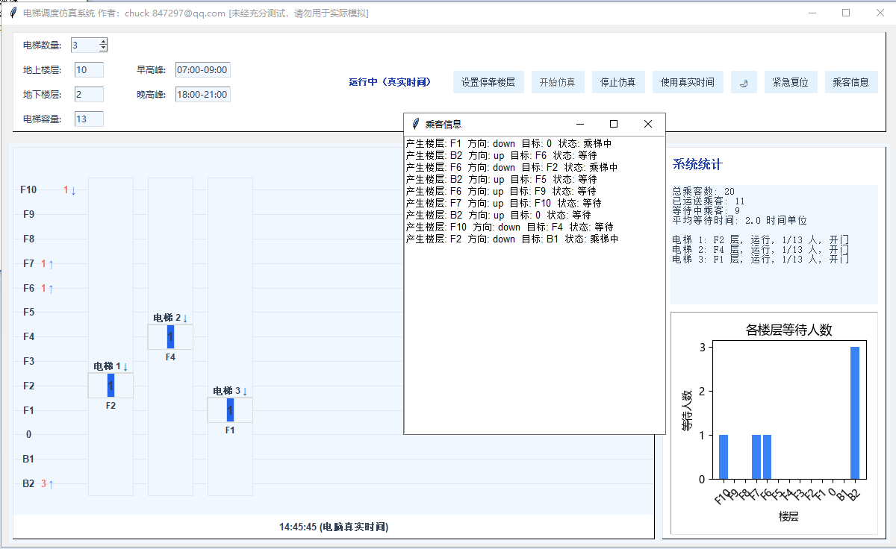

elevator simulator， fun game.
# 电梯调度仿真系统

一个基于 Python 和 Tkinter 的多电梯调度仿真系统，支持高峰时段模拟、UI 交互、统计分析、紧急复位等功能。适用于电梯控制算法教学、仿真演示与实验研究。

## 功能特点

- 多电梯支持，地上/地下楼层灵活可配
- 支持高峰时段模拟（早晚高峰可自定义）
- 电梯容量、停靠楼层可设定
- 乘客自动生成及上下车逻辑
- 实时仿真与真实时间切换
- 丰富的图形界面（Tkinter），可视化电梯与乘客状态
- 统计栏实时显示每部电梯状态（开门/关门/空闲/运行/载客数等）
- 各楼层等待人数柱状图
- 紧急复位功能：所有电梯直达0层，系统状态全清零
- 模拟的随机乘客信息（楼层，目标楼层，候梯/乘梯中/乘梯结束），以浮动窗口显示，5个时间值清除乘梯结束的乘客。
- 
## 快速开始

### 环境要求

- Python 3.7+
- 依赖库：`tkinter`、`matplotlib`

### 安装依赖

- Tkinter 通常为 Python 自带
- 安装 matplotlib:
  ```bash
  pip install matplotlib
  ```

### 运行方式

```bash
python elevator_system_gui.py
```

## 主要界面说明

- **参数设置区**：设置电梯数量、楼层范围、电梯容量、高峰时段等
- **仿真/统计区**：左侧为电梯和楼层实时可视化，右侧为统计和等待人数分布图
- **操作按钮**：
    - 开始仿真/停止仿真
    - 设置停靠楼层
    - 切换真实时间/仿真时间
    - 紧急复位（所有电梯直达0层并清空系统）
    - 黑暗模式切换

## 项目结构

```
elevator_system_gui.py   # 主程序及全部逻辑
README.md                # 使用说明
```

## 常见问题

- **中文字体/负号显示异常**：如 matplotlib 柱状图坐标负号或部分中文不显示，可在代码中设置 `matplotlib.rcParams['axes.unicode_minus'] = False` 并优先选择支持负号的中文字体（如微软雅黑）。
- **Tkinter 窗口不显示**：请确保 Python 安装了 Tkinter 支持。
- **紧急复位无效**：请用最新版完整代码，复位后所有电梯会自动直达0层并清空所有状态。

## 许可证

MIT License

## 致谢

本项目受多部电梯仿真算法、教学案例启发，欢迎用于学习和研究。
